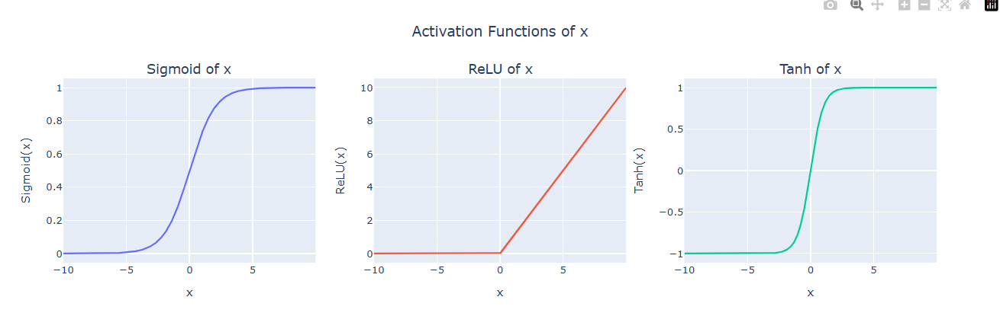

# PyTorch

Reference: [https://colab.research.google.com/drive/12lbY_WkglJETde8aCl51Q7uZrkBvrdnZ](https://colab.research.google.com/drive/12lbY_WkglJETde8aCl51Q7uZrkBvrdnZ)

Pytorch is python library that help us to create AI model from scratch and it let us process and prepare our data.

# Pytorch OOP

But before we deep into pytorch tutorial, I will introduce you about OOP in python.

[Python OOP](https://www.notion.so/Python-OOP-1e2a5ca462ef80e99d3ede4856685d9f?pvs=21)

**** Caution!!! you need to understand about OOP before going to pytorch topics****

# Pathlib

**Pathlib module** in [**Python**](https://www.geeksforgeeks.org/python-programming-language-tutorial/) offers classes and methods to quickly perform the most common tasks involving file system paths, incorporating features from several other standard modules like os.path, glob, shutil, and os.

`Path classes` in **Pathlib module** are divided into **pure paths** and **concrete paths**. Pure paths provides only computational operations but does not provides I/O operations, while concrete paths inherit from pure paths provides computational as well as I/O operations.

For using Pathlib we need to import it, like this:

```python
from pathlib import Path
```

To list all subdirectories in a directory, we can use the `iterdir()` method and filter for directories:

```python
from pathlib import Path

p = Path('/')

for subdir in p.iterdir(): # like using ls in bash
    if subdir.is_dir():
        print(subdir)
```

We can use `glob` to search in that directories.

```python
test.glob('cat/*')
```

or we can use `rglob` to recursively searches directories.

```python
from pathlib import Path

p = Path('/')

files = p.rglob('*.py')
for f in files:
    print(f)
```

Now you may curious, what the fak is `*/` or `/*` , `*` (asterisk) is text pattern that mean use everything inside that path so basically `*` represent anything in that path and position.

# Dataset

Dataset is pytorch class that help us easier to pre-process dataset and query data.

```python
from torch.utils.data import Dataset

class AnimalDataset(Dataset):
    def __init__(self):
        self.data = [
            ("Human", "Hi", 2),
            ("Dog", "Hong", 4),
            ("Cat", "Maew", 4),
            ("Cow", "Moo", 4),
        ]

    def __len__(self):
        return len(self.data)

    def __getitem__(self, idx):
        data = self.data[idx]
        X = data[:2]
        y = data[-1]
        return X, y
```

When create your own class dataset, you need to create 3 methods:

- __init__ : preprocess data and initialize data.
- __len__: find length of our data in dataset.
- __getitem__: query data by provide parameter

## Transform

In pytorch there is method to transform image for preprocess or augmentation.

```python
from torchvision import transforms

transform_ops = transforms.Compose([
    transforms.Resize(size=(256, 256)),             # Resize image
    transforms.Grayscale(num_output_channels=1),    # Grayscale
    transforms.RandomHorizontalFlip(p=0.5),         # Random Horizontal Flip
    transforms.RandomRotation(degrees=15),          # Random Rotation
])
```

and then we can apply transform to our class.

```python
from pathlib import Path
from glob import glob
from PIL import Image
from torch.utils.data import Dataset

class AnimalsDataset(Dataset):
    def __init__(self, image_dir, transform=None):
        self.image_dir = Path(image_dir)
        self.labels = [d.name for d in self.image_dir.glob("*") if d.is_dir()]
        self.transform = transform  # 👈 Add transform

        self.samples = [(p, p.parent.name) for p in self.image_dir.glob('**/*.jp*g')]

    def __len__(self):
        return len(self.samples)

    def __getitem__(self, idx):
        img_path, label = self.samples[idx]
        image = Image.open(img_path).convert('RGB')
        if self.transform:          # 👈 Add transform
            image = self.transform(image)
        return image, label
```

## Huggingface Dataset

Huggingface provide function `load_dataset`  for download it own data which base on pytorch dataset class. we use this code to load data.

```python
from datasets import load_dataset

dataset = load_dataset(path="senmeetechin/animals-10-top100-5cls")
```

We can use `split` to download only the train, test, or validation sets

```
from datasets import load_dataset

dataset = load_dataset(path="senmeetechin/animals-10-top100-5cls", split=['train'])   # 👈 select only train data
print(dataset)
```

# Basic Tensor

I already talk about **What is Tensor?** in: [Tensorflow](https://www.notion.so/Tensorflow-17aa5ca462ef808db9e4e68cf7bc1fae?pvs=21), If you don’t know what is it just click it!

## What is Tensor?

PyTorch uses tensors because they are fast, powerful, and work seamlessly with:

- automatic differentiation (autograd)
- GPU acceleration
- model layers and optimization

## Tensor and Tensor’s Methods

### Importing

```python
import torch
import numpy as np
```

### Create Tensor Methods

```python
v1 = np.array([1,2,3])                      # assign numpy array
v2 = torch.tensor([1,2,3])                  # assign tensor
v_t = torch.from_numpy(v1)                  # assign tensor from numpy array

print(f"v1 ({v1.dtype}): {v1}")
print(f"v2 ({v2.dtype}): {v2}")
print(f"v_t ({v_t.dtype}): {v_t}")
```

```python
a = torch.tensor([1, 2, 3])                         # vector (1D tensor)
b = torch.tensor([[1,2,3],[4,5,6]])                 # matrix (2D tensor)

print(f"a shape={a.shape}: {a}")
print(f"b shape={b.shape}: {b}")
```

```python
# Create matrix with all 0 values
A0 = torch.zeros(3,2)  # matrix (2D tensor)
print(f"A0: {A0}")

# Create matrix with all 1 values
A1 = torch.ones(3,2)  # matrix (2D tensor)
print(f"A1: {A1}")
```

```python
# Create vector with arange number
V1 = torch.arange(10)
print("V1:", V1)

V2 = torch.arange(0, 1, 0.1)
print("V2:", V2)
```

```python
c = torch.tensor([[1,2,3],
                  [4,5,6]])

# Create zero matrix with the same dimension
c0 = torch.zeros_like(c)
print("c0:", c0)

# Create one matrix with the same dimension
c1 = torch.ones_like(c)
print("c1:", c1)
```

### Set Type of Tensor

```python
# set type of tensor
a = torch.tensor([1, 2, 3])
print("Type of a:", a.dtype)

b = torch.tensor([1, 2, 3], dtype=float)
print("Type of b:", b.dtype)

c = torch.tensor([1, 2, 3]).float()
print("Type of c:", c.dtype)
```

### Tensor operations

Similar to `numpy` library, there are many tensor operations we can perform. `+`, `*`, `multiply` (element-wise multiplication), `matmul` (`mm` for tensor or matrix multiplication).

```python
# Addition
A = torch.tensor([[1,2,3], [4,5,6]])
B = torch.ones_like(A)

A + B

# Subtraction
A = torch.tensor([[1,2,3], [4,5,6]])
B = torch.ones_like(A)

A - B
```

```python
# Scalar multiplication
A = torch.tensor([[1,2,3], [4,5,6]])

A * 2
```

```python
# Element-wise multiplication
A = torch.tensor([[1,  2, 3], [4, 5,  6]])
B = torch.tensor([[-1, 0, 1], [1, 0, -1]])

A * B, torch.multiply(A, B)

# Element-wise division
A = torch.tensor([[1,  2, 3], [4, 5,  6]])
B = torch.tensor([[-1, 0, 1], [1, 0, -1]])

A / B, torch.divide(A, B)
```

```python
# Matrix multiplication
A = torch.tensor([[1,  2, 3], [4, 5,  6]])
B = torch.tensor([[1, 2], [0, 1], [2, 0]])

A @ B, A.matmul(B), A.mm(B)
```

### Combine Tensor

```python
# Matrix multiplication
A = torch.tensor([[1,  2, 3], [4, 5,  6]])
B = torch.tensor([[1, 2], [0, 1], [2, 0]])

A @ B, A.matmul(B), A.mm(B)
```

```python
# Combine tensor
A = torch.tensor([[ 1,  2,  3],
                  [ 4,  5,  6]])
B = torch.tensor([[ 7,  8,  9],
                  [10, 11, 12]])

torch.cat((A,B))

torch.cat((A, B), dim=0)    # concat as 0=rows, 1=columns
```

or we can use `vstack` (concat vertical) or hstack (concat horizontal).

```python
torch.vstack((A, B))
'''
tensor([[ 1,  2,  3],
        [ 4,  5,  6],
        [ 7,  8,  9],
        [10, 11, 12]])
'''

torch.hstack((A, B))
'''
tensor([[ 1,  2,  3,  7,  8,  9],
        [ 4,  5,  6, 10, 11, 12]])
'''
```

### Squeeze

hard

### Manipulate Dimension of Tensor

```python
# flatten tensor
A = torch.tensor([[1, 2],
                  [3, 4]])

A.flatten()
```

```python
# set dimension
A = torch.tensor([[1, 2, 3, 4],
                  [5, 6, 7, 8]])

A_v = A.view(1, -1)     # 👈 set dimension to 1 row, free column

print("A:", A.shape)
print(A)
print("\nA_v:", A_v.shape)
print(A_v)
```

```python
# set dimension
A = torch.tensor([[1, 2, 3, 4],
                  [5, 6, 7, 8]])

A_v = A.view(-1, 2)     # 👈 set dimension to 2 columns, free row

print("A:", A.shape)
print(A)
print("\nA_v:", A_v.shape)
print(A_v)
```

## Autograd

One of the most powerful functionality of PyTorch is that it can calculate gradients.

before we going to code section, I gonna talk about **Backpropagation** first!

- **Backpropagation** is **the process** used in training neural networks to **calculate the gradient** (the derivative) of the loss function with respect to each weight.
- It **uses** the rules of **calculus**, mainly the **chain rule for differentiation**.
- So in short: **backpropagation is applying differentiation over and over, layer by layer, backward through the network**.

In very simple terms:

- **Differentiation (diff)** = Finding how fast something changes (slope/gradient).
- **Backpropagation** = Using **differentiation** to find how changing each weight changes the total error, so the network can adjust the weights.

So **Backpropagation** ≠ **Differentiation!!!**

```python
import torch

# Create a tensor with requires_grad=True to track gradients
x = torch.tensor(2., requires_grad=True)        # 👈 Tracking x
```

For example, I will create simple formula.

```python
y = x**2 + 3*x + 5
```

and then we use to backpropagation to find gradient of x = 2

```python
y.backward()       # 👈 Calculate dy/dx, then save gradient to x.grad
                   # y'(x) = 2x + 3
                   # y'(2) = 2(2) + 3 = 7
                   
# Print the gradient dy/dx
print(f"Gradient at x = 2.0: {x.grad}")
```

```python
import torch

# Create a tensor of multiple features, requires_grad=True to track gradients
x = torch.tensor([2.0, 3.0], requires_grad=True)  # 👈 set x[0] = 2.0, x[1] = 3.0

# Define a function of y = x₀² + 2x₁ + 5
y = x[0]**2 + 2 * x[1] + 5

# Backpropagate
y.backward()                                    # 👈 Calculate dy/x₀ and dy/x₁, then save gradient to x.grad
                                                # dy/d(x₀) = 2x₀ -> 2(2) = 4
                                                # dy/d(x₁) = 2   -> 2

# Check gradients
print(f"x[0] gradient (dy/dx₀): {x.grad[0]}")
print(f"x[1] gradient (dy/dx₁): {x.grad[1]}")

```

## **Functional**

There are two main ways to create a non-linear activation function in PyTorch. The first is to use the `torch.nn` module, which contain a pre-defined activation functions. The second is to use the `torch.nn.functional` module, which contains a large number of functions that can be used as an activation functions. documentation: [https://pytorch.org/docs/stable/nn.functional.html](https://www.google.com/url?q=https%3A%2F%2Fpytorch.org%2Fdocs%2Fstable%2Fnn.functional.html)

```python
import torch
import torch.nn as nn
import torch.nn.functional as F
import matplotlib.pyplot as plt
```

### **Basic activation function**

```python
# Create tensor of X in range [-10, 10]
x = torch.arange(-10, 10, 0.01)

# apply with activation function
x_sigmoid = F.sigmoid(x)
x_relu = F.relu(x)
x_tanh = torch.tanh(x)
```

```python
import plotly.graph_objects as go
from plotly.subplots import make_subplots

fig = make_subplots(rows=1, cols=3, subplot_titles=("Sigmoid of x", "ReLU of x", "Tanh of x"))

# Plot Sigmoid
fig.add_trace(go.Scatter(x=x, y=x_sigmoid, mode='lines', name='Sigmoid'), row=1, col=1)

# Plot ReLU
fig.add_trace(go.Scatter(x=x, y=x_relu, mode='lines', name='ReLU'), row=1, col=2)

# Plot Tanh
fig.add_trace(go.Scatter(x=x, y=x_tanh, mode='lines', name='Tanh'), row=1, col=3)

# Update layout
fig.update_layout(
    height=400, width=1200,
    showlegend=False,
    title="Activation Functions of x",
    title_x=0.5
)

# Set axis labels
fig.update_xaxes(title_text="x", row=1, col=1)
fig.update_yaxes(title_text="Sigmoid(x)",  row=1, col=1)

fig.update_xaxes(title_text="x", row=1, col=2)
fig.update_yaxes(title_text="ReLU(x)",  row=1, col=2)

fig.update_xaxes(title_text="x", row=1, col=3)
fig.update_yaxes(title_text="Tanh(x)",  row=1, col=3)

fig.show()

```



more about functional i already write about this topic in [Activation Function](https://www.notion.so/Activation-Function-17ea5ca462ef8077a145d70b21aceddf?pvs=21) 

# Neuron Network Module

## **Design Model Architecture**

Summary of the Benefits of nn.Module:

- Simplifies Model Building: Helps in structuring the model in a clean and reusable manner.
- Handles Parameters: Automatically registers all layers and their parameters (weights and biases).
- Autograd Compatibility: Ensures that gradients are tracked and can be computed for backpropagation.
- Easy Model Management: Offers methods to save, load, and move models between devices.
- Standardization: Provides a consistent interface to define the forward pass and interact with your model.

```python
import torch
import torch.nn as nn
import torch.optim as optim

class AnimalClassificationModel(nn.Module):
    def __init__(self):
        super().__init__()

        # Define model layers
        self.layer1 = nn.Linear(in_features=784, out_features=128)  # Example: input 784 (28x28), output 128
        self.layer2 = nn.Linear(in_features=128, out_features=64)   # Example: 128 -> 64 units
        self.layer3 = nn.Linear(in_features=64, out_features=5)     # Example: 64 -> 5 classes (for 5 classes)
        self.relu = nn.ReLU()                                       # Activation function

    def forward(self, x):
        # Forward pass: pass data through layers
        x = x.view(x.size(0), -1)                                   # 👈 Flatten image 28x28 -> 784
        x = self.relu(self.layer1(x))
        x = self.relu(self.layer2(x))
        x = self.layer3(x)
        return x

# Initialize the model
model = AnimalClassificationModel()
print(model)
```

## **Calculate Loss function and Gradient**

After we implement model, we will use our model to calculate loss. 

```python
# use our model with data
pred = model(X)
pred
```

```python
# calculate loss
loss_fn = nn.CrossEntropyLoss()         # CrossEntropyLoss handles softmax internally
loss = loss_fn(pred, torch.tensor(y).unsqueeze(0))
print("Loss:", loss)
```

```python
loss.backward()        # 👈 calculate gradient of each model weight & bias from loss
```

```python
# show gradient from each params
for name, param in model.named_parameters():
    if param.requires_grad:
        print(f"{name}: {param.grad}")
```

## Set Optimizer


document: [https://pytorch.org/docs/main/optim.html](https://www.google.com/url?q=https%3A%2F%2Fpytorch.org%2Fdocs%2Fmain%2Foptim.html)

you can understand more about optimizer in [Optimizer](https://www.notion.so/Optimizer-17ea5ca462ef808c9955db9cd3ab376b?pvs=21).

```python
optimizer = optim.SGD(model.parameters(), lr=0.01)  # Stochastic Gradient Descent
optimizer.step()    # 👈 update weights & bias
                    # param = param - learning_rate * param.grad
```

## Combine Our Code in 1 cell

```python
# Initialize the model
model = AnimalClassificationModel()

# Test data
X, y = train_ds[0]

# Loss function and optimizer
loss_fn = nn.CrossEntropyLoss()
optimizer = optim.SGD(model.parameters(), lr=0.01)

model.train()           # 👈 Set model to train mode

output = model(X)
loss = loss_fn(output, torch.tensor(y))
loss.backward()
optimizer.step()
```

## Batching


A **batch** is **a small group of samples** (data points) that you feed into the model **at once** during training.

Instead of giving the model one sample at a time (very slow) or the entire dataset at once (too big for memory), **you split your data into batches**.

Example:

Suppose you have **1000** images.

- **Batch size 32** → you divide it into groups of 32 images at a time.
- So you’ll have about **31-32 batches** per "epoch" (full pass through the data).

Benefit of Batching:

- **Efficiency (Faster Training)**
    - It’s faster to process a few samples at once using matrix operations (which computers/GPUs are good at), rather than one-by-one.
- **Memory Management**
    - Loading the entire dataset at once can **crash your RAM** or **GPU memory**. Batching lets you control memory usage.
- **Smoother Gradient Updates**
    - Using a batch gives you a **more stable estimate** of the gradient compared to just one sample (which can be noisy and random).
- **Flexibility for Optimization**
    - Many optimizers (like Adam, SGD) are designed to work with batches and improve faster than pure single-sample updates.

### **Epoch**:

One full pass through the whole dataset.

### Batch size

Number of samples per batch.

> Small batch = better generalization but slower.
Big batch = faster but risk of overfitting and needing more memory.
> 

---

**Typical Choices:**

- **32, 64, 128** are common batch sizes.
- Sometimes **256, 512, 1024** if you have strong GPUs (like in big company servers).
- **Really huge batch** (10,000+) is used in special research (and they need special tricks to make it work well).
- more batch is good but not always!!

## Feed all batch

```
# Initialize the model
model = AnimalClassificationModel()

# Loss function and optimizer
loss_fn = nn.CrossEntropyLoss()
optimizer = optim.SGD(model.parameters(), lr=0.01)

model.train()
total_loss = 0                                        # 👈 set total_loss

# Train with data
for i, (inputs, labels) in enumerate(train_loader):   # 👈 loop for all train batch
    optimizer.zero_grad()                             # 👈 clear old gradients
    outputs = model(inputs)
    loss = loss_fn(outputs, labels)
    loss.backward()
    optimizer.step()
    total_loss += loss.item()                         # 👈 addition all loss from each batch
    print(f"Finish batch{i+1}/{len(train_loader)}")

print("\nLoss:", total_loss)
```

## Validation

```python
model.eval()                              # 👈 Set model to eval mode

total_val_loss = 0.0
correct = 0
total = 0

with torch.no_grad():                     # 👈 Avoid gradient calculation
    for inputs, labels in val_loader:     # 👈 loop for all val batch
        outputs = model(inputs)
        loss = loss_fn(outputs, labels)
        total_val_loss += loss.item()

        # calculate accuracy
        predicted = outputs.argmax(dim=1) # 👈 get prediction with max value
        correct += (predicted == labels).sum().item()

val_accuracy = 100 * correct / len(val_ds)
print("Val Loss:", total_val_loss)
print("Val acc:", val_accuracy)
```

torch.no_grad() help us to avoid gradient which comsume many computational resources.

## All Code

```python
# Initialize the model
model = AnimalClassificationModel()

# Loss and optimizer
loss_fn = nn.CrossEntropyLoss()
optimizer = optim.Adam(model.parameters(), lr=0.001)

# Training loop
num_epochs = 5

# 👇 Training stats
train_losses = []
val_losses = []
val_accuracies = []

for epoch in range(num_epochs):       # 👈 Loop multiple epochs

    # Training
    model.train()
    total_train_loss = 0.0

    for inputs, labels in train_loader:
        optimizer.zero_grad()
        outputs = model(inputs)
        loss = loss_fn(outputs, labels)
        loss.backward()
        optimizer.step()
        total_train_loss += loss.item()

    # Valiation
    model.eval()

    total_val_loss = 0.0
    correct = 0

    with torch.no_grad():
        for inputs, labels in val_loader:
            outputs = model(inputs)
            loss = loss_fn(outputs, labels)
            total_val_loss += loss.item()

            # calculate accuracy
            predicted = outputs.argmax(dim=1)
            correct += (predicted == labels).sum().item()

    val_accuracy = 100 * correct / len(val_ds)

    # 👇 collect train history
    train_losses.append(total_train_loss)
    val_losses.append(total_val_loss)
    val_accuracies.append(val_accuracy)

    print(f"\nEpoch {epoch+1}")
    print(f"Train Loss={total_train_loss}")
    print(f"Val   Loss={total_val_loss}")
    print(f"Val   Acc ={val_accuracy}")
```

## All code with GPU

### **When using GPU (CUDA) in PyTorch:**

You must:

1. **Move your model to GPU**
    
    ```python
    python
    CopyEdit
    model = model.to('cuda')
    ```
    
2. **Move your data (input tensors) to GPU**
    
    ```python
    python
    CopyEdit
    inputs = inputs.to('cuda')
    labels = labels.to('cuda')
    ```
    

✅ **Both the model *and* the data must be on the same device (CPU or GPU)**.

If model is on GPU and data is on CPU (or vice versa), you'll get an error.

```python
from datasets import load_dataset
from PIL import Image
from torch.utils.data import Dataset, DataLoader
from torchvision import transforms

class AnimalsDataset(Dataset):
    def __init__(self, dataset_name, split='train', transform=None):
        self.dataset = load_dataset(dataset_name, split=split)

        self.transform = transform

        self.images = self.dataset['image']
        self.labels = self.dataset['label']

    def __len__(self):
        return len(self.images)

    def __getitem__(self, idx):
        image = self.images[idx]
        label = self.labels[idx]

        if self.transform:
            image = self.transform(image)

        return image, label

# Transform
transform_train = transforms.Compose([
    transforms.Resize(size=(28, 28)),
    transforms.Grayscale(num_output_channels=1),
    transforms.RandomHorizontalFlip(p=0.5),
    transforms.RandomRotation(degrees=15),
    transforms.ToTensor()
])

transform_test = transforms.Compose([
    transforms.Resize(size=(28, 28)),
    transforms.Grayscale(num_output_channels=1),
    transforms.ToTensor()
])

# Create dataset
train_ds = AnimalsDataset(dataset_name='senmeetechin/animals-10-top100-5cls', split='train', transform=transform_train)
val_ds = AnimalsDataset(dataset_name='senmeetechin/animals-10-top100-5cls', split='validation', transform=transform_test)

# Read as DataLoader
train_loader = DataLoader(dataset=train_ds, batch_size=16, shuffle=True)
val_loader = DataLoader(dataset=val_ds, batch_size=16, shuffle=False)
```

```python
import torch
import torch.nn as nn
import torch.optim as optim
import plotly.graph_objects as go
from tqdm import tqdm

class AnimalClassificationModel(nn.Module):
    def __init__(self):
        super().__init__()

        # Define model layers
        self.layer1 = nn.Linear(in_features=784, out_features=128)  # Example: input 784 (28x28), output 128
        self.layer2 = nn.Linear(in_features=128, out_features=64)   # Example: 128 -> 64 units
        self.layer3 = nn.Linear(in_features=64, out_features=5)     # Example: 64 -> 5 classes (for 5 classes)
        self.relu = nn.ReLU()                                       # Activation function

    def forward(self, x):
        # Forward pass: pass data through layers
        x = x.view(x.size(0), -1)                                   # Flatten image 28x28 -> 784
        x = self.relu(self.layer1(x))
        x = self.relu(self.layer2(x))
        x = self.layer3(x)
        return x
```

```python
# 👇 Create as class
class Trainer:
    def __init__(self, model, train_loader, val_loader, n_val, lr=0.001, epochs=10):
        # 👇 Add device
        self.device = torch.device("cuda" if torch.cuda.is_available() else "cpu")    # 👈 Add device
        self.model = model.to(self.device)                                            # 👈 Apply device to model
        self.train_loader = train_loader
        self.val_loader = val_loader
        self.n_val = n_val
        self.epochs = epochs

        self.loss_fn = nn.CrossEntropyLoss()
        self.optimizer = optim.Adam(self.model.parameters(), lr=lr)

        self.train_losses = []
        self.val_losses = []
        self.val_accuracies = []

        print(f"Trainer ready on device: {self.device}")                             # 👈 print device when ready

    def train(self):
        for epoch in tqdm(range(self.epochs), desc="Training Epochs"):

            # Training
            self.model.train()
            total_train_loss = 0.0

            for inputs, labels in self.train_loader:
                inputs, labels = inputs.to(self.device), labels.to(self.device)       # 👈 Apply device to tensor
                self.optimizer.zero_grad()
                outputs = self.model(inputs)
                loss = self.loss_fn(outputs, labels)
                loss.backward()
                self.optimizer.step()
                total_train_loss += loss.item()

            # Validation
            self.model.eval()
            total_val_loss = 0.0
            correct = 0

            with torch.no_grad():
                for inputs, labels in self.val_loader:
                    inputs, labels = inputs.to(self.device), labels.to(self.device)   # 👈 Apply device to tensor
                    outputs = self.model(inputs)
                    loss = self.loss_fn(outputs, labels)
                    total_val_loss += loss.item()
                    predicted = outputs.argmax(dim=1)
                    correct += (predicted == labels).sum().item()

            val_accuracy = 100 * correct / self.n_val

            # train history
            self.train_losses.append(total_train_loss)
            self.val_losses.append(total_val_loss)
            self.val_accuracies.append(val_accuracy)

    def plot_history(self):
          epochs = list(range(1, self.epochs + 1))

          fig = go.Figure()

          # Plot loss
          fig.add_trace(go.Scatter(x=epochs, y=self.train_losses, mode='lines+markers', name='Train Loss'))
          fig.add_trace(go.Scatter(x=epochs, y=self.val_losses, mode='lines+markers', name='Val Loss'))

          # Plot accuracy
          fig.add_trace(go.Scatter(x=epochs, y=self.val_accuracies, mode='lines+markers', name='Val Accuracy', yaxis='y2'))

          # Layout
          fig.update_layout(
              title='Training & Validation Metrics',
              xaxis_title='Epoch',
              yaxis=dict(title='Loss'),
              yaxis2=dict(title='Accuracy (%)', overlaying='y', side='right'),
              legend=dict(x=0.5, y=1.1, orientation="h", xanchor='center'),
              width=800,
              height=500
          )

          fig.show()
```

```python
model = AnimalClassificationModel()
trainer = Trainer(model, train_loader, val_loader, n_val=len(val_ds), lr=0.001, epochs=10)
trainer.train()
trainer.plot_history()
```

## Save and load model

When we save model in torch , there is 2 way to save your model!

- `.pth` save only model weights
- `.pt` save entire model

### Save model state_dict

```python
torch.save(model.state_dict(), "model_weights.pth")
```

### Load model state_dict

```python
new_model = AnimalClassificationModel()
new_model.load_state_dict(torch.load("model_weights.pth"))
```

### Save entire model

```python
torch.save(model, "full_model.pt")
```

### **Load entire model**

```python
new_model = torch.load("full_model.pt", weights_only=False)
```

## **Apply with Conv2d**

```python
import torch.nn as nn

class AnimalClassificationModel(nn.Module):
    def __init__(self):
        super().__init__()

        self.conv_layers = nn.Sequential(
            nn.Conv2d(1, 32, kernel_size=3, padding=1),  # (B, 1, 28, 28) -> (B, 32, 28, 28)
            nn.ReLU(),
            nn.MaxPool2d(2),                             # -> (B, 32, 14, 14)

            nn.Conv2d(32, 64, kernel_size=3, padding=1), # -> (B, 64, 14, 14)
            nn.ReLU(),
            nn.MaxPool2d(2),                             # -> (B, 64, 7, 7)
        )

        self.fc_layers = nn.Sequential(
            nn.Flatten(),                                # -> (B, 64*7*7)
            nn.Linear(64 * 7 * 7, 128),
            nn.ReLU(),
            nn.Linear(128, 5)                            # -> (B, 5)
        )

    def forward(self, x):
        x = self.conv_layers(x)
        x = self.fc_layers(x)
        return x
```

## Handle Overfitting

```python
import torch.nn as nn

class AnimalClassificationModel(nn.Module):
    def __init__(self):
        super().__init__()

        self.conv_layers = nn.Sequential(
            nn.Conv2d(1, 32, kernel_size=3, padding=1),   # -> (B, 32, 28, 28)
            nn.BatchNorm2d(32),                           # 👈 Add BatchNorm
            nn.ReLU(),
            nn.MaxPool2d(2),                              # -> (B, 32, 14, 14)

            nn.Conv2d(32, 64, kernel_size=3, padding=1),  # -> (B, 64, 14, 14)
            nn.BatchNorm2d(64),                           # 👈 Add BatchNorm
            nn.ReLU(),
            nn.MaxPool2d(2),                              # -> (B, 64, 7, 7)
            nn.Dropout(0.25)                              # 👈 Add Dropout
        )

        self.fc_layers = nn.Sequential(
            nn.Flatten(),                                 # -> (B, 64*7*7)
            nn.Linear(64 * 7 * 7, 128),
            nn.ReLU(),
            nn.Dropout(0.5),                              # 👈 Add Dropout
            nn.Linear(128, 5)                             # -> (B, 5)
        )

    def forward(self, x):
        x = self.conv_layers(x)
        x = self.fc_layers(x)
        return x

```

So that’s all about Pytorch!!!